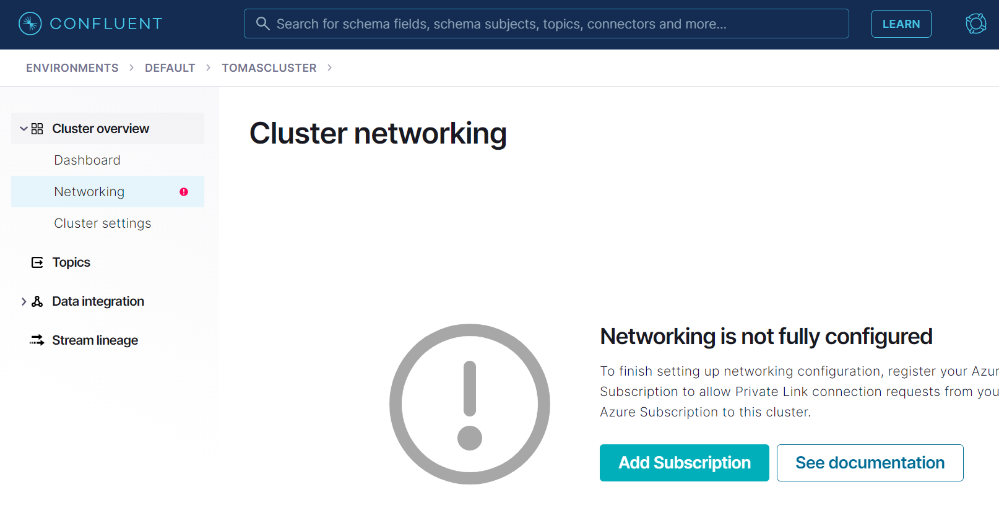
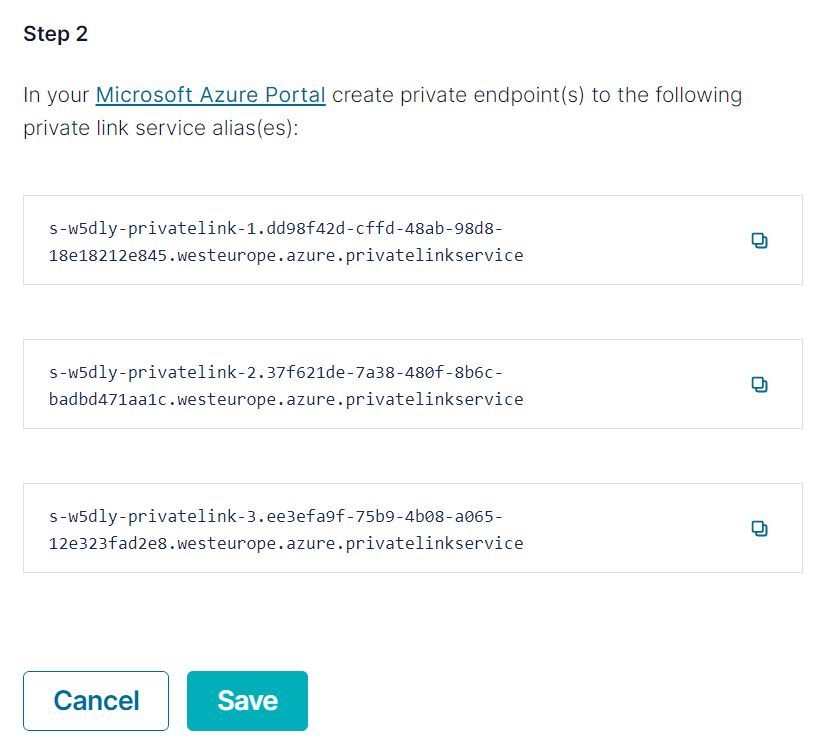
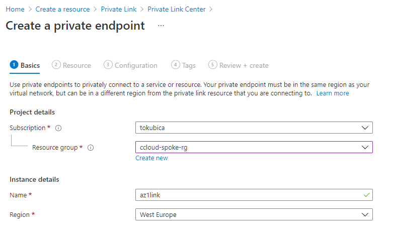
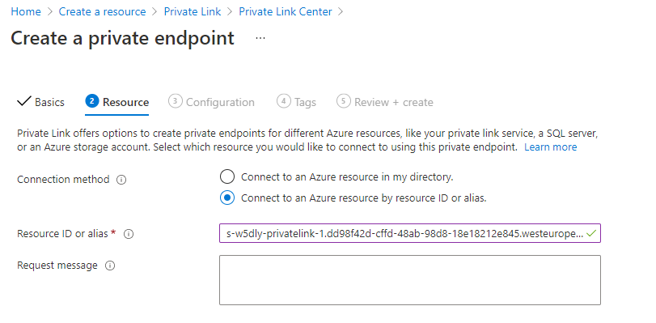
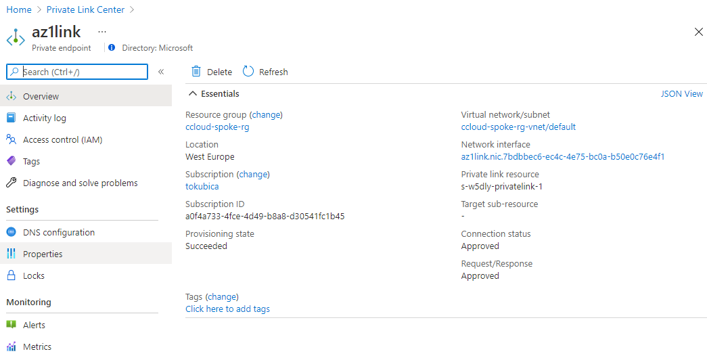
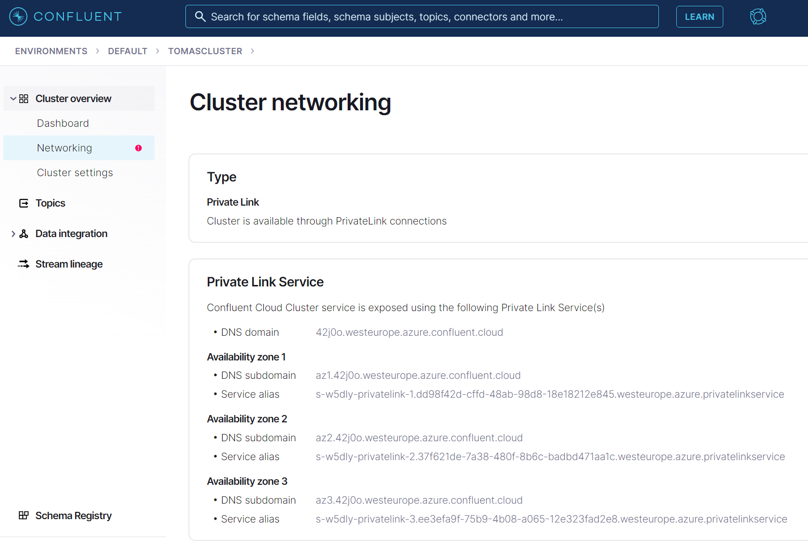

# Confluent Cloud
Integration via Private Link to Kafka cluster running in Confluent Cloud requires multiple DNS entries to be configured. There is no out-of-the-box automation and you can use any DNS server to configure entries. 

Assumptions (typical enterprise environment)
- Central custom DNS server machine in hub is used to provide manageability, advanced security and forwarding to on-premises for all spoke VMs
- Shared resources in hub such as network or DNS zone there is no writing permission given to spoke users for security, potential conflicts and separation of duties reasons. 
- Resources in Confluent Cloud are mapped to Private Endpoint in users spoke network (as opposed to shared hub) to lower complexity and costs (no need to pay for traffic between spoke, hub, processing costs on hub firewall, need to manage central firewall rules) - this is consistent with typical strategy for 1st party Azure PaaS (eg. Azure SQL is mapped to spoke network of its user)

## Option 1 - centralized DNS zone in hub network
In this scenario IT team is maintaining records in Azure Private DNS zone in hub so company DNS server in hub can forward requests to it. Rather than using separate zone for each Kafka cluster centralized solution can leverage single zone for everyone.

Note in this scenario there is central zone such as westeurope.azure.confluent.cloud configured and more clusters share it (eg. cluster 42j0o.westeurope.azure.confluent.cloud)

As IT team is in the loop automation is desirable to keep resolution time as short as possible, prevent human errors and lower operational costs. I would suggest to hold state (existing Kafka clusters) in simple data structure which is consumed by infrastructure automation, which is than responsible for keeping DNS records in place (add or delete as Kafka cluster list changes). List of Kafka clusters can be maintained manually (eg. via ticket), managed via GitOps (users can pull request) or automated (cron job pulling list of clusters using Confluent Cloud API).

Disadvantages:
- IT process can be automated, but will still likely require some manual work such as creating ticket

You can find example records management Terraform template in option1-centralized folder. All records are maintained in ccloudInstances.yaml which becomes source of truth. You can than automate process of entering objects into this file:
- Generate file by listing cluster using ccloud API
- Automatically append entries to file based on ticket request (and automate garbage collection eg. using ccloud API to find deleted clusters)
- Let users add entries to file using GitOps and pull requests

## Option 2 - specific DNS zone in spoke network with hub mapping
In this scenario spoke subscription users are responsible for creating and maintaining necessary zones and records. This zone in spoke subscription needs to be mapped hub VNET where custom DNS server machine is running.

Note in this scenario users are creating zones specific to their cluster such as 42j0o.westeurope.azure.confluent.cloud and not westeurope.azure.confluent.cloud!

Disadvantages:
- There is limit of 1000 zones mapped to single VNET - since hub VNET with DNS server must be linked to all private link and other zones this might be limiting some large customers (eg. when you need more than 1000 Kafka clusters in region).

Should you want spoke user to be self-sufficient you need to allow Microsoft.Network/virtualNetworks/join/action permission to hub VNET. This is likely not desirable in enterprise environment therefore in this demo I use Azure Policy to do this configuration automatically on behalf of user without giving permissions away. Drawback of Azure Policy is 15 minutes delay to make this change.

As an example deploy Terraform template in option2-decentralized folder. Than login as restricted spoke user, create DNS zone and observe policy will connect it to hub VNET.

```bash
## Get service principal
export password=$(terraform output -raw client_secret)
export spid=$(terraform output -raw client_id)
export paasSubnetId=$(terraform output -raw paasSubnetId)

## Get hub VNET id
export hubVnetId=$(terraform output -raw hubVnetId)

## Login to Azure with SP
az login --service-principal --username $spid --password $password --tenant microsoft.com

## Create DNS zone and link it to hub VNET
az network private-dns zone create -g ccloud-spoke-rg -n 42j0o.westeurope.azure.confluent.cloud

## Observe zone has been linked to hub automatically
az network private-dns link vnet list -g ccloud-spoke-rg -z 42j0o.westeurope.azure.confluent.cloud

## Delete DNS zone
az network private-dns zone delete -g ccloud-spoke-rg -n 42j0o.westeurope.azure.confluent.cloud
```

## Setting up private link with Confluent Cloud
Follow official documentation steps. Here are few screeenshots:

Create dedicated cluster and then add your Azure subscription.




Get private link services IDs.




Create private endpoints.





Wait for all links to get approved by ccloud.




Note DNS information and use to configure Azure Private DNS either using centralized or decentralized option.



